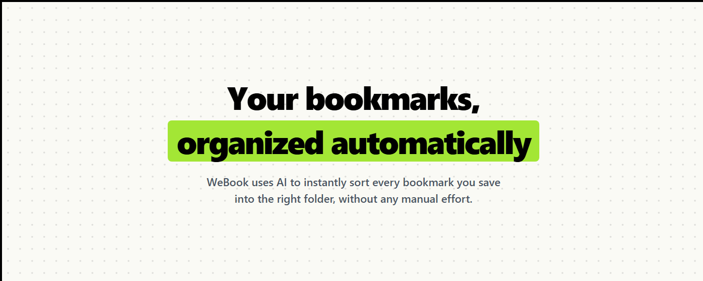
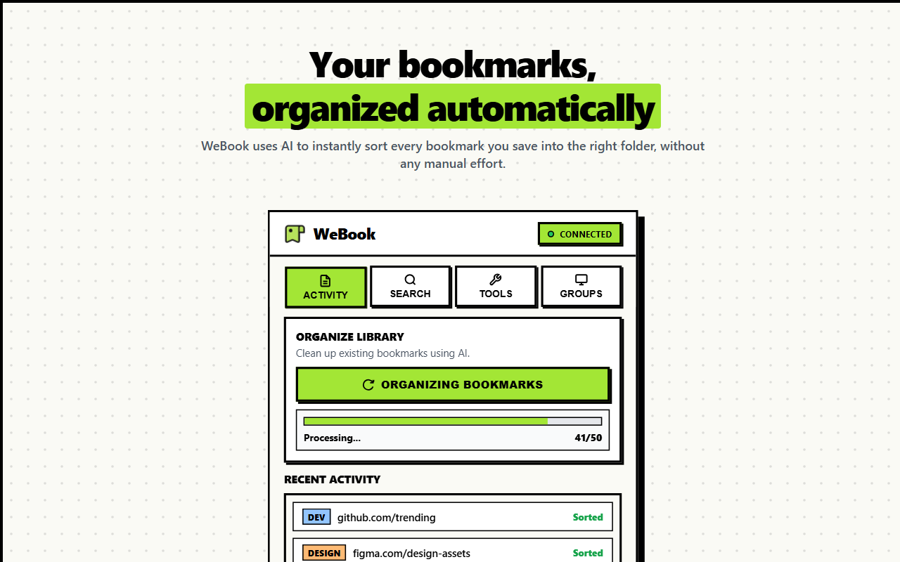
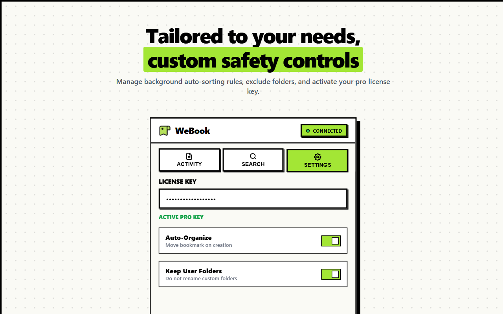
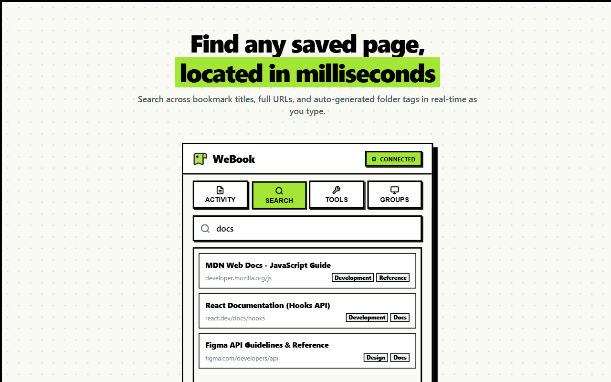
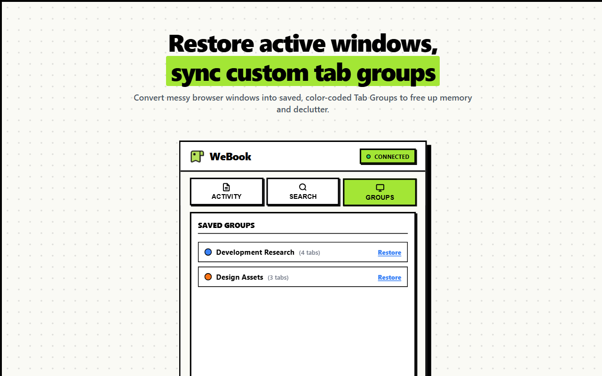
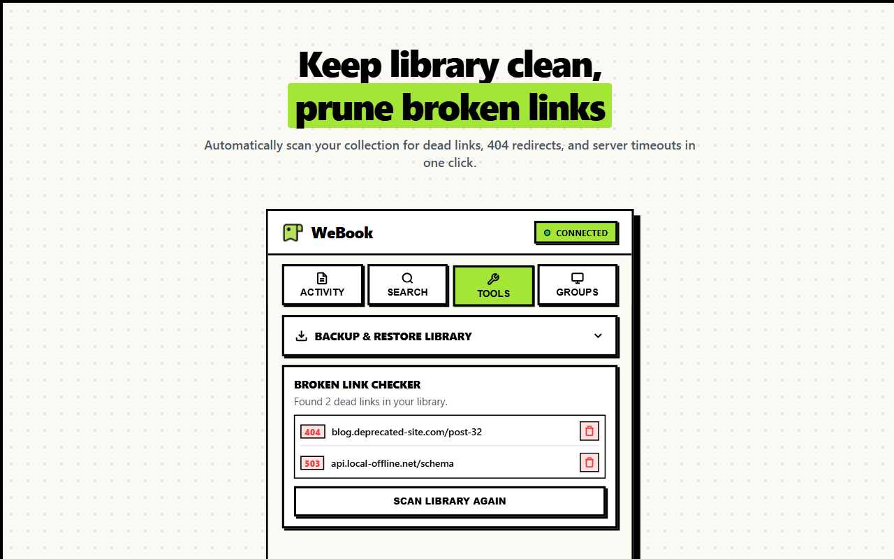

#  WeBook — Smart Bookmark Manager

> **v8.2.0** · Chrome Extension · AI-Powered Bookmark Organizer with Tab Groups

[](https://chromewebstore.google.com/detail/webook/ggikgoohejhgihbfkehpmacbmlhnmljp)



WeBook automatically organizes your bookmarks into smart folders using AI, enriches them with specific tags, detects duplicates, saves Chrome tab groups, and is optimized for simple self-hosting.

---

## 🎥 Demo Video

<div align="center">
  <a href="https://www.youtube.com/watch?v=eQL9jOv_TCo" target="_blank">
    
  </a>
  <br>
  <br>
  <a href="https://www.youtube.com/watch?v=eQL9jOv_TCo" target="_blank">
    
  </a>
</div>

---

## ✨ Features

### 🤖 AI Auto-Organize
- Automatically categorizes every bookmark you save into the right folder
- Uses OpenRouter AI to classify by site purpose, not just page title
- **Metascraper-enhanced** — scrapes live page metadata (title, description, OG tags) before classification for higher accuracy
- Falls back gracefully if AI or scraping is unavailable



### 🔍 Metascraper Integration (v8 — New)
- Automatically fetches rich page metadata before AI classification
- Scrapes title, description, author, publisher, language, and Open Graph tags
- Supports YouTube, Amazon, and all standard HTML pages
- Private/local URL detection — skips scraping for `localhost`, custom ports, IP ranges, and VPN addresses
- Fast-fail timeouts (3 s direct, 4 s Microlink fallback) so classification is never blocked
- Graceful degradation — falls back to URL-only classification if scraping fails

#### 📊 Accuracy Benchmark
To demonstrate [Metascraper's](https://metascraper.js.org) exceptional accuracy, here is how it outperforms similar libraries:

| Library | **[Metascraper](https://metascraper.js.org)** | html-metadata | node-metainspector | open-graph-scraper | unfluff |
| :--- | :---: | :---: | :---: | :---: | :---: |
| **Correct** |  | 74.56% | 61.16% | 66.52% | 70.90% |
| **Incorrect** | 1.79% | 1.79% | 0.89% | 6.70% | 10.27% |
| **Missed** | 2.68% | 23.67% | 37.95% | 26.34% | 8.95% |


### 🔧 Easy Self-Hosting (v3 — New)
- Completely free and unlocked for local or private hosting. No licensing keys or limits.
- Fully adjustable Server/Proxy URL directly configurable in the extension Settings tab.
- DB-free mode (auto-generates admin secrets and runs classification fallbacks if OpenRouter key is omitted).



### 🏷️ Smart Tags (v7)
- Generates **exactly 3 specific tags** per bookmark — brand names, technologies, proper nouns
- Blocks 80+ generic/vague words (`new`, `launches`, `tech`, `internet`, `invisible`, `common`, etc.)
- No fallback padding — 1 great tag beats 5 meaningless ones

### 🔎 Instant Search & Context Actions (v8.2)
- **Fast Search** — Instantly filter and search through your bookmarks and tab groups.
- **Custom Context Menus** — Right-click any result to Open Incognito, Copy URL, Edit Bookmark, or Delete Bookmark.
- **Inline Editing** — Edit bookmark names directly in the search results view.
- **Hover Path Tooltip** — Hover over any result to instantly preview its bookmark folder path.



### 📁 Tab Groups (v7)
- **Save open tabs** as a named Chrome tab group with a color
- Groups saved to **Other Bookmarks** (not Favorites Bar)
- **Expand saved groups** to preview all tabs without opening them
- **Restore** a group by clicking its name — reopens all tabs as a Chrome group
- **Export to JSON** — full structured backup including embedded tab data per group
- **Import JSON** — clean replace (wipes old data, recreates bookmark folders fresh)
- Accordion UI — Create Group and Export/Import cards collapse by default



### 🔍 Duplicate Detection
- Detects and flags duplicate bookmarks across your library
- Shows duplicate count and lets you review before deleting

### 🔗 Broken Link Checker
- Scans your bookmarks for dead links (4xx / 5xx responses)
- Shows status per bookmark with bulk-delete option



### 📤 Export / Import
- **Export HTML** — standard browser-compatible bookmarks file
- **Export JSON** — full structured backup with folders, tags, metadata, and saved tab groups
- **Import JSON** — clean restore from any WeBook backup

---

## 🚀 Installation

### 🌐 Official Chrome Web Store (Recommended)
Install WeBook directly in one click:

[](https://chromewebstore.google.com/detail/webook/ggikgoohejhgihbfkehpmacbmlhnmljp)

### 🛠️ Developer Mode (Manual Installation)
If you want to run the developer build:
1. Clone or download this repo
2. Open `chrome://extensions` in Chrome
3. Enable **Developer Mode** (top right)
4. Click **Load unpacked** → select the `extension` folder
5. The WeBook icon will appear in your toolbar

> **Server**: see [`server/`](./server/) for the Node.js proxy server setup.

---

## 🌐 Local Development

Run the proxy server locally at **http://localhost:3000**:

```bash
cd server
npm install
npm run dev
```

---

## 🗂️ Project Structure

```
webook/
├── extension/
│   ├── manifest.json    # Chrome extension manifest v3
│   ├── popup.html       # Extension popup UI
│   ├── popup.css        # Popup styles
│   ├── popup.js         # Popup logic
│   └── background.js    # Service worker (auto-organize, duplicate detection)
└── server/
    ├── server.js        # Node.js proxy (AI classify, metascraper)
    ├── .env.example     # Environment variable template
    ├── Dockerfile       # Container setup
    └── package.json
```

---

## ⚙️ Environment Variables (Server)

Copy `server/.env.example` to `server/.env` and fill in:

```env
OPENROUTER_API_KEY=your_openrouter_key
MODEL_NAME=openai/gpt-4o-mini
PORT=3000
```

All variables are optional! If `OPENROUTER_API_KEY` is omitted, categorization falls back to local keyword matching.

---

## 📖 Usage

### Saving a Bookmark
Just bookmark any page in Chrome — WeBook auto-organizes it in the background using AI and live metadata from Metascraper.

### Tab Groups Tab
1. Open the WeBook popup → click **Tab Groups** tab
2. Check the tabs you want to group
3. Name your group, pick a color → **Create Group**
4. Your group appears in **Saved Groups** — click **▼** to preview tabs, click the **name** to restore

### Server URL Configuration
1. Open the WeBook popup → click **Settings** tab.
2. Enter your self-hosted server address in the **Server URL** input field (defaults to `http://localhost:3000`).
3. Click **Save Settings** to test and persist the configuration.

### Export / Import
- **Export JSON**: saves all bookmarks + saved tab groups
- **Import JSON**: completely replaces saved groups and recreates bookmark folders fresh

---

## 🔄 Changelog

### v8.2.0
- ✅ **Custom Context Menus & Inline Editing** — Adds right-click options for search results (Open Incognito, Copy URL, Edit Bookmark, Delete Bookmark) and replaces double-click gestures with menu-driven inline editing.
- ✅ **Search Hover Paths** — Displays full bookmark folder paths in tooltip previews on hovering over search items.
- ✅ **Local MV3 Favicons** — Switched to the modern Chrome MV3 favicon fetching API (`chrome://favicon2`) for fast, local favicon rendering.
- ✅ **Link Check De-duplication** — Automatically de-duplicates link check results.
- ✅ **Layout Scrollbar Fixes** — Eliminated unwanted scrollbars in the Link Checker success card and empty Saved Groups container.
- ✅ **SVG Fallback Fix** — Switched to Base64-encoded SVG fallback images to avoid HTML quote collision errors.
- ✅ **Version bumped to 8.2.0**

### v8.1.0
- ✅ Added extension maintenance documentation for update-free changes
- ✅ Version bumped to 8.1.0

### v8.0.0
- ✅ **Metascraper integration** — live URL scraping before AI classification (title, description, OG, YouTube, Amazon)
- ✅ **Weekly free key system** — auto-rotates every Sunday 00:00 UTC (calendar week, not rolling 7-day)
- ✅ **Local website hosting** — landing page served at `localhost:3000` via Express static
- ✅ **Auto-detecting PROXY_URL** — same-origin locally
- ✅ **Mobile promo banner fix** — stacks cleanly on mobile, no mid-key text wrapping
- ✅ **Tab groups → Other Bookmarks** — saved groups no longer clutter the Favorites Bar
- ✅ CORS updated to allow `localhost:3000` and `PATCH` method
- ✅ Version bumped to 8.0.0

### v7.0.0
- ✅ Tab Groups: create, save, preview, restore Chrome tab groups
- ✅ Export embeds `tabs[]` inline per group (self-contained backup)
- ✅ Import: clean replace strategy — wipes old data, recreates fresh
- ✅ Tags: top 3 specific tags only, 80+ word stop-list, no generic fallbacks
- ✅ Accordion UI for Create Group and Export/Import cards
- ✅ Separate expand (▼) vs restore (name click) actions on saved groups
- ✅ Version bumped to 7.0.0

### v6.0.0
- AI-powered auto-organize with OpenRouter
- Duplicate detection and broken link checker
- HTML and JSON export/import
- Smart folder normalization and merge logic

---

## 🤝 Support & Issue Reporting

If you encounter bugs, need help, or want to request a feature, please use the appropriate channel:
- 🐛 **[Report a Bug](https://github.com/isumenuka/WeBook/issues/new?template=bug_report.md)** — Let us know if something isn't working as expected.
- ✨ **[Request a Feature](https://github.com/isumenuka/WeBook/issues/new?template=feature_request.md)** — Suggest ideas and enhancements to improve WeBook.
- 💬 **[Discussions & Support](https://github.com/isumenuka/WeBook/discussions)** — Ask questions, seek setup support, and connect with the community.

---

## 📄 License

MIT License — see the [LICENSE](./LICENSE) file for details.

---

<p align="center">Made with ☕ · <a href="https://github.com/isumenuka/WeBook">github.com/isumenuka/WeBook</a></p>
